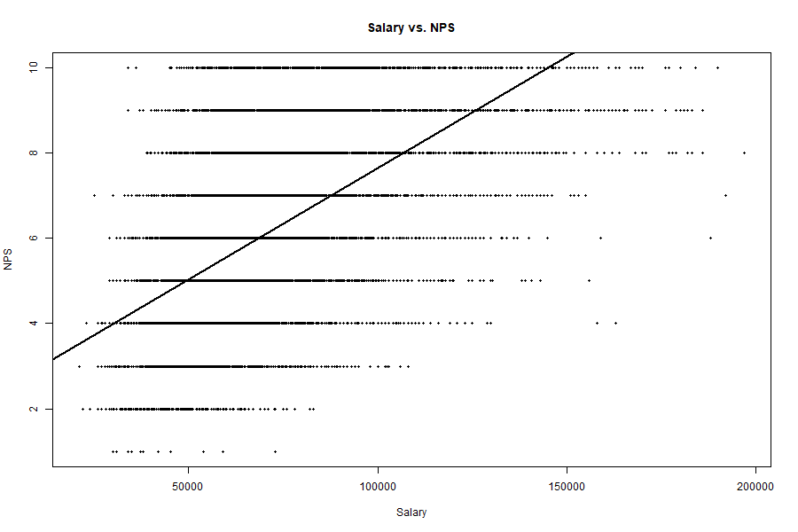
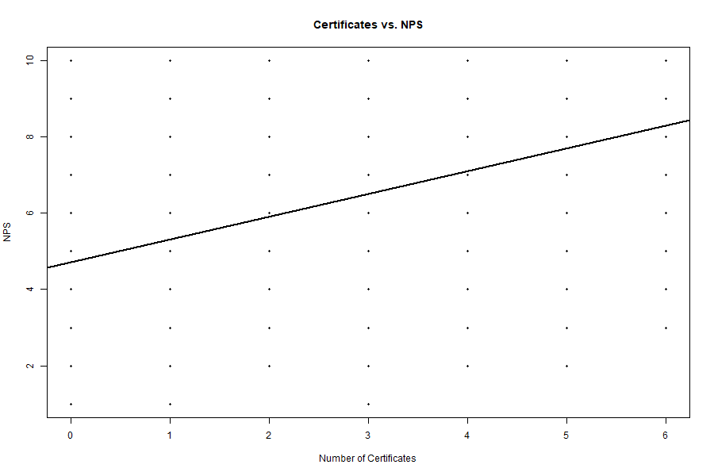
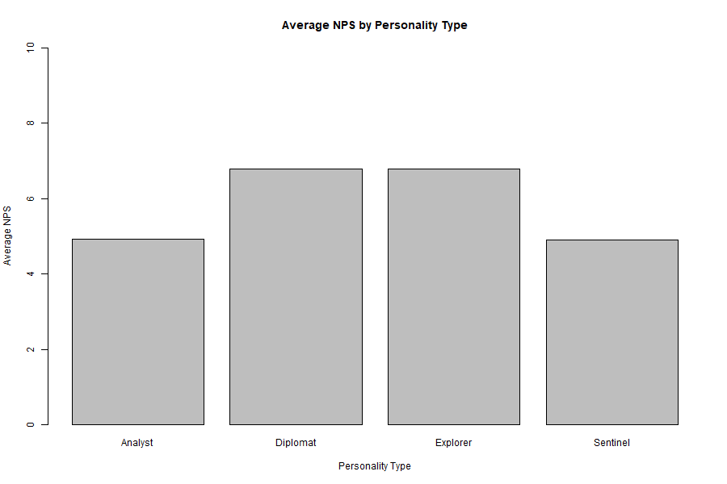

# Tech Sales Representative Performance Analysis

## Project Overview
This business analytics project uses R to analyze data from 21,990 technology sales representatives. The goal is to explore how factors such as salary, certifications, employee feedback, experience, age, education, personality, and business type are associated with Net Promoter Score (NPS).

## Tools Used
- R
- RStudio
- readxl
- Descriptive statistics
- Data visualization
- Correlation analysis

## Analysis
The project includes:
- Data inspection and missing-value checks
- Descriptive statistics
- Histograms and bar charts
- Scatterplots
- Correlation analysis
- Group comparisons using average NPS

## Key Findings
- Salary had the strongest positive association with NPS (r = 0.550).
- Certifications were positively associated with NPS (r = 0.455).
- Employee feedback showed a moderate positive association with NPS (r = 0.278).
- Years of experience had a smaller positive association with NPS (r = 0.203).
- Age had very little linear association with NPS (r = 0.037).
- Diplomat and Explorer personality groups had higher average NPS scores than Analyst and Sentinel groups.

## Visualizations

### Salary vs. NPS

### Certificates vs. NPS

### Average NPS by Personality

## Business Value
This analysis demonstrates how exploratory data analysis can help identify workforce characteristics associated with sales performance. These findings can support further investigation into employee development, compensation, training, and performance management.

> Note: Correlation indicates association and does not establish causation.

## Repository Files
- `tech_sales_analysis.R` — R script containing the analysis.
- `README.md` — Project documentation.

## Data
The source dataset is not included in this public repository.
